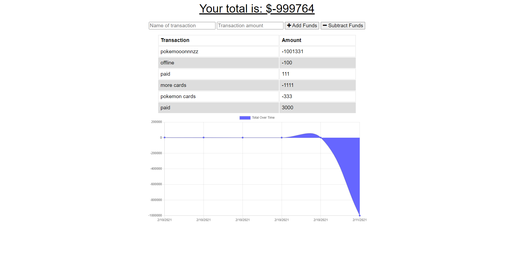

## Online-Offline-Budget-Tracker

#### **Table of Contents**

---

1. [Installalation](#installation)
1. [Usage](#usage)
1. [Credits](#credits)
1. [License](#license)

#### **Installation**

---

To intall this application using prebuilt html and css elements involved this:

1. Install the npm dependencies.
1. Type node server.js.

#### **Usage**

---

Once the application is started.  You will see two inputs and two buttons.  The first input is where you list the name of the transaction you are placing, and the second is the amount.  Once both are filled you click either "Add Funds" or "Subtract Funds" depending on the type of transaction it is.  If you want to install this application, you can go into options and click "Install Budget Tracker".  This will allow you to run the application even when you don't have an internet connection.

Link to the deployed website can be found [here](https://murmuring-waters-52428.herokuapp.com/).

Link to the GitHub repository is [here](https://aqueous-springs-26268.herokuapp.com/).

#### **Credits**

---

Thanks for the great activities to review.

#### **License**

---

Copyright (c) 2005-2020 David Heinemeier Hansson

Permission is hereby granted, free of charge, to any person obtaining
a copy of this software and associated documentation files (the
"Software"), to deal in the Software without restriction, including
without limitation the rights to use, copy, modify, merge, publish,
distribute, sublicense, and/or sell copies of the Software, and to
permit persons to whom the Software is furnished to do so, subject to
the following conditions:

The above copyright notice and this permission notice shall be
included in all copies or substantial portions of the Software.

THE SOFTWARE IS PROVIDED "AS IS", WITHOUT WARRANTY OF ANY KIND,
EXPRESS OR IMPLIED, INCLUDING BUT NOT LIMITED TO THE WARRANTIES OF
MERCHANTABILITY, FITNESS FOR A PARTICULAR PURPOSE AND
NONINFRINGEMENT. IN NO EVENT SHALL THE AUTHORS OR COPYRIGHT HOLDERS BE
LIABLE FOR ANY CLAIM, DAMAGES OR OTHER LIABILITY, WHETHER IN AN ACTION
OF CONTRACT, TORT OR OTHERWISE, ARISING FROM, OUT OF OR IN CONNECTION
WITH THE SOFTWARE OR THE USE OR OTHER DEALINGS IN THE SOFTWARE.
